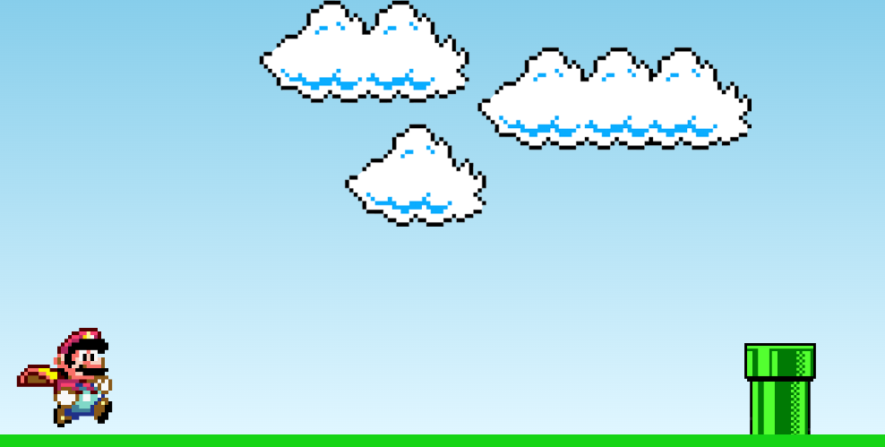

<h1 align="center"> MarioJump </h1>

  

## 🚀 Tecnologias

Esse projeto foi desenvolvido com as seguintes tecnologias:

- HTML
- CSS
- JavaScript

## 💻 Projeto

O Mario Jump é um projeto de um jogo baseado no "Jogo do dinossauro" do Google.